# Immortallis Portfolio & CV

This is my personal portfolio/ CV built with **Next.js**, **TypeScript**, and **Tailwind CSS**. Features an integrated contact form with rate limiting, media gallery with Cloudinary integration, and analytics tracking.

## Tech Stack

- **Framework**: Next.js 14+ (React 19+)
- **Language**: TypeScript
- **Styling**: Tailwind CSS, PostCSS
- **Backend**: Netlify Functions
- **Media**: Cloudinary CDN
- **Analytics**: Google Analytics
- **Effects**: AIFX visual effects library
- **Hosting**: Netlify

## Architecture

```mermaid
flowchart TD

subgraph group_presentation["Page Presentation"]
  node_root_layout["Root Layout<br/>[layout.tsx]"]
  node_home_page["Home Page<br/>[page.tsx]"]
  node_header["Site Header<br/>[Header.tsx]"]
  node_footer["Site Footer<br/>[Footer.tsx]"]
end

subgraph group_portfolio["Portfolio Content"]
  node_projects["Project Showcase<br/>[Projects.tsx]"]
  node_personality["Personal Profile<br/>[Personality.tsx]"]
  node_skills["Skills Section<br/>[Skills.tsx]"]
  node_company_history["Company Timeline<br/>[CompanyHistory.tsx]"]
  node_career["Career Section<br/>[Career.tsx]"]
  node_testimonials["Testimonials Section<br/>[Testimonials.tsx]"]
  node_gallery["Gallery Section<br/>[Gallery.tsx]"]
end

subgraph group_contact["Contact Workflow"]
  node_contact_form["Contact Form<br/>[Contact.tsx]"]
  node_contact_endpoint["Contact Endpoint<br/>[contact-form.ts]"]
  node_form_validation["Form Validation<br/>[contact-form.ts]"]
  node_rate_limiter["Submission Rate Limit<br/>[contact-form.ts]"]
end

subgraph group_integrations["External Integrations"]
  node_cloudinary["Cloudinary Media"]
  node_analytics["Google Analytics"]
  node_aifx["AIFX Effects"]
end

node_visitor(("Portfolio Visitor"))

node_visitor -->|"opens site"| node_root_layout
node_root_layout -->|"renders page"| node_home_page
node_home_page -->|"renders header"| node_header
node_home_page -->|"renders projects"| node_projects
node_home_page -->|"renders profile"| node_personality
node_home_page -->|"renders skills"| node_skills
node_home_page -->|"renders timeline"| node_company_history
node_home_page -->|"renders career"| node_career
node_home_page -->|"renders testimonials"| node_testimonials
node_home_page -->|"renders gallery"| node_gallery
node_home_page -->|"renders form"| node_contact_form
node_home_page -->|"renders footer"| node_footer
node_contact_form -->|"submits form"| node_contact_endpoint
node_contact_endpoint -->|"checks limit"| node_rate_limiter
node_contact_endpoint -->|"validates fields"| node_form_validation
node_contact_endpoint -->|"returns status"| node_contact_form
node_projects -.->|"loads media"| node_cloudinary
node_company_history -.->|"loads media"| node_cloudinary
node_root_layout -.->|"loads tracking"| node_analytics
node_root_layout -.->|"loads effects"| node_aifx

classDef toneNeutral fill:#f8fafc,stroke:#334155,stroke-width:1.5px,color:#0f172a
classDef toneBlue fill:#dbeafe,stroke:#2563eb,stroke-width:1.5px,color:#172554
classDef toneAmber fill:#fef3c7,stroke:#d97706,stroke-width:1.5px,color:#78350f
classDef toneMint fill:#dcfce7,stroke:#16a34a,stroke-width:1.5px,color:#14532d
classDef toneRose fill:#ffe4e6,stroke:#e11d48,stroke-width:1.5px,color:#881337
classDef toneIndigo fill:#e0e7ff,stroke:#4f46e5,stroke-width:1.5px,color:#312e81
class node_root_layout,node_home_page,node_header,node_footer toneBlue
class node_projects,node_personality,node_skills,node_company_history,node_career,node_testimonials,node_gallery toneAmber
class node_contact_form,node_contact_endpoint,node_form_validation,node_rate_limiter toneMint
class node_cloudinary,node_analytics,node_aifx toneRose
class node_visitor toneIndigo
```



### Key Features

- **Responsive Design**: Mobile-first approach with Tailwind CSS
- **Contact Form**: Server-side validation, rate limiting, and Netlify Function integration
- **Performance**: Optimized images with Cloudinary CDN, analytics tracking
- **Visual Effects**: AIFX effects library for enhanced interactivity
- **Structured Content**: Dedicated sections for projects, skills, career timeline, and testimonials

## Getting Started

### Prerequisites

- Node.js 18+
- npm or yarn

### Installation

```bash
# Clone the repository
git clone <repo-url>
cd immortallis-600-rr

# Install dependencies
npm install
```

### Development

```bash
# Start development server
npm run dev

# Open browser
# http://localhost:3000
```

### Build & Deploy

```bash
# Build for production
npm run build

# The build output is ready for Netlify deployment
# Netlify automatically detects next.config.js and deploys with the correct settings
```

## Project Structure

```
src/
├── app/
│   ├── layout.tsx          # Root layout with analytics & effects
│   ├── page.tsx            # Home page (main portfolio view)
│   ├── contact.css         # Contact form styling
│   └── globals.css         # Global styles
└── components/
    └── sections/           # Reusable portfolio sections
        ├── Header.tsx      # Navigation & hero
        ├── Personality.tsx # Personal introduction
        ├── Skills.tsx      # Technical skills
        ├── Projects.tsx    # Project showcase
        ├── CompanyHistory.tsx  # Work timeline
        ├── Career.tsx      # Career overview
        ├── Testimonials.tsx    # Social proof
        ├── Gallery.tsx     # Media gallery
        ├── Contact.tsx     # Contact form
        └── Footer.tsx      # Footer with links

netlify/
└── functions/
    └── contact-form.ts     # Serverless contact endpoint

lib/
├── constants.ts            # App configuration
└── careerData.json         # Career & experience data
```

## Configuration

- **`tailwind.config.js`**: Tailwind CSS customization
- **`next.config.js`**: Next.js build & optimization settings
- **`netlify.toml`**: Netlify deployment configuration
- **`tsconfig.json`**: TypeScript compiler options

## Contact Form

The contact form uses a Netlify Function with:
- ✅ Email field validation
- ✅ Rate limiting (prevents spam)
- ✅ Server-side processing
- ✅ Error handling & user feedback

## Deployment

This site is configured for **Netlify**:

1. Push to your GitHub repository
2. Connect the repository to Netlify
3. Netlify automatically detects the Next.js setup
4. Your site deploys on every push to `main`

Environment variables needed:
- Contact form backend configuration (set in Netlify dashboard)

## License

© Stephen Gault. All rights reserved.
